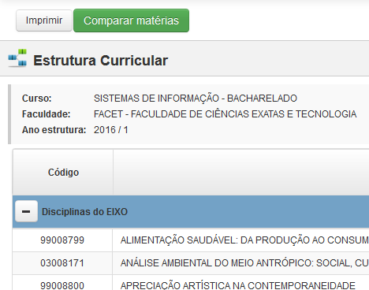

# UFGD BOOST

Webextension com melhorias no [SIGECAD-Acadêmico da UFGD](http://sigecad-academico.ufgd.edu.br).

## [Baixar para Google Chrome ](http://bit.ly/UfgdBoostChrome)

## Baixar para Firefox

*Indisponível no momento*

### Melhorias prontas

1. Botão para comparar as matérias que você já concluíu / está matriculado na página de estrutura curricular.

### Contribua

Para contribuir é necessário seguir algumas convenções:

* O idioma padrão deve ser o pt-BR. Tanto nos commits quanto no nome das variáveis etc. A extensão é voltada ao público brasileiro, é bom definir esse idioma padrão pois pode facilitar o entendimento de quem está começando a programar e quer ajudar.
* Variáveis com padrão lowerCamelCase. ([clique aqui para saber mais sobre](https://pt.wikipedia.org/wiki/CamelCase))
* Quando uma alteração for feita é necessário mudar a versão da extensão no manifest.json. Estamos seguindo o padrão SEMVER. ([clique aqui para saber mais sobre](http://semver.org/lang/pt-BR/))

### Changelog

* 2.0.0
	* Removido ZeptoJS, FetchPollyfill e PromisePollyfill para poder ser aceito pela Mozilla.
	* Inserido o jQuery

* 1.1.3
	* [FEATURE] Adicionado complementos das legendas de acordo com regra da UFGD.

* 1.1.2
	* [FEATURE] Adicionado complementos da legenda de APE aprovado por exame

* 1.1.1
  * [FEATURE] Mostrar como aprovado as matérias que foram dispensadas por currículo (dica do Filipe De Andrade Maldonado e Adolfo Eduardo)
  * [FIX] Quando reprova na matéria e depois passa, fica com class class="aprovado reprovado" (dica do Rafael Ferreira)

### Roadmap

* Botão para selecionar matérias equivalentes (dica do Marcos Kunz)

###### made with ♥ for students
